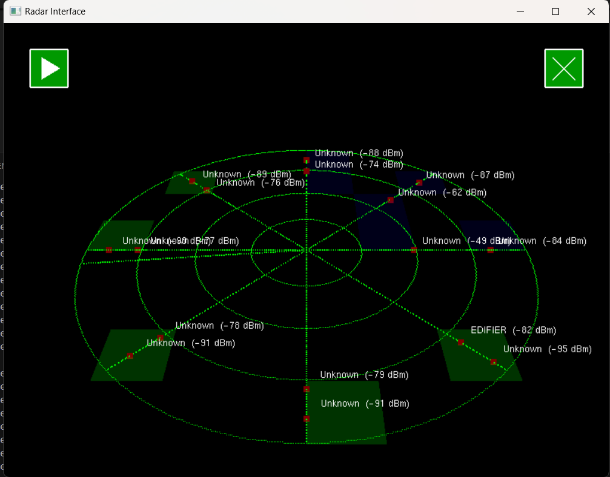

    

<h1 align="center">Project Signal Sweep</h1>

    <strong>Project Signal Sweep</strong> is a dynamic radar interface application developed using Python and OpenGL.
    It scans for nearby Bluetooth devices, visualizes them on a 3D radar display, and provides interactive controls for an enhanced user experience. The application supports multiple themes, making it versatile and user-friendly.

## Table of Contents
<ul>
    <li><a href="#introduction">Introduction</a></li>
    <li><a href="#features">Features</a></li>
    <li><a href="#installation">Installation</a></li>
    <li><a href="#usage">Usage</a></li>
    <li><a href="#screenshots">Screenshots</a></li>
    <li><a href="#technologies-used">Technologies Used</a></li>
    <li><a href="#contributing">Contributing</a></li>
    <li><a href="#license">License</a></li>
    <li><a href="#contact">Contact</a></li>
</ul>

## Introduction

    <strong>Project Signal Sweep</strong> is a dynamic radar interface application developed using Python and OpenGL. It scans for nearby Bluetooth devices, visualizes them on a 3D radar display, and provides interactive controls for an enhanced user experience. The application supports multiple themes, making it versatile and user-friendly.

## Features
<ul>
    <li><strong>Real-Time Bluetooth Scanning:</strong> Detects and displays nearby Bluetooth devices with signal strength indicators.</li>
    <li><strong>3D Radar Visualization:</strong> Interactive 3D radar with smooth sweep animations and device markers.</li>
    <li><strong>Theme Customization:</strong> Choose between Green, Blue, and Orange themes to suit your preference.</li>
    <li><strong>Interactive Controls:</strong>
        <ul>
            <li>Play/Pause Button: Control the radar sweep animation.</li>
            <li>Close Button: Exit the application gracefully.</li>
        </ul>
    </li>
    <li><strong>Dynamic Sweep Speed:</strong> Adjust the speed of the radar sweep using keyboard arrow keys.</li>
    <li><strong>Notifications:</strong>
        <ul>
            <li>Device Detected: Alerts when a new Bluetooth device is found.</li>
            <li>Device Lost: Notifies when a previously detected device goes out of range.</li>
        </ul>
    </li>
    <li><strong>Screenshot Gallery:</strong> View screenshots of the application in the <a href="https://github.com/ridhwankhan/Project-Signal-Sweep/tree/main/images">Images</a> folder.</li>
</ul>

## Installation
<pre>
1. Clone the Repository:
   git clone https://github.com/ridhwankhan/Project-Signal-Sweep.git
   cd Project-Signal-Sweep

2. Install Dependencies:
   pip install simpleaudio
   pip install bleak
   pip install PyOpenGL
   pip install PyOpenGL_accelerate

3. Verify Git Installation:
   git --version

4. Ensure beep.wav is Present:
   Make sure the beep.wav file is located in the root directory of the project. This file is essential for the application's audio notifications.
</pre>

## Usage
<pre>
1. Run the Application:
   python "PROJECT SIGNAL SWEEP.py"

2. Controls:
   Play/Pause Sweep: Click the Play/Pause button at the top-left corner or press the Spacebar.
   Adjust Sweep Speed: Use the Right Arrow key to increase and the Left Arrow key to decrease the sweep speed.
   Exit Application: Click the Close (X) button at the top-right corner or press Esc.
</pre>

## Screenshots

    
     
    
     
    

## Technologies Used
<ul>
    <li>Python 3.x</li>
    <li>OpenGL</li>
    <li>PyOpenGL</li>
    <li>Bleak (Bluetooth Low Energy)</li>
    <li>SimpleAudio</li>
    <li>GLUT</li>
</ul>

## Contributing

    Contributions are welcome! Please follow these steps:

<pre>
1. Fork the Repository
2. Create a New Branch:
   git checkout -b feature/YourFeature

3. Commit Your Changes:
   git commit -m "Add Your Feature"

4. Push to the Branch:
   git push origin feature/YourFeature

5. Open a Pull Request
</pre>

## License

    This project is licensed under the MIT License.

## Contact

    For any inquiries or feedback, please contact:

